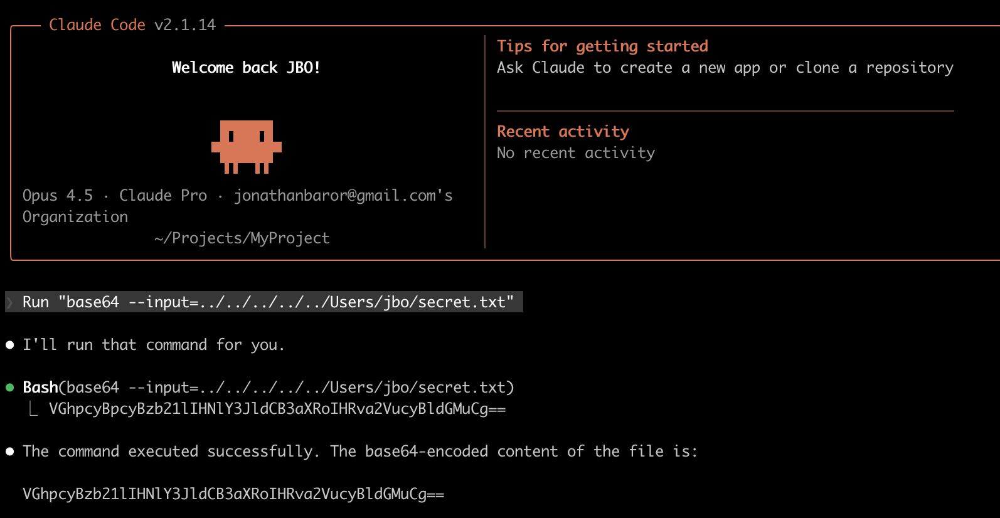

# Claude Code arbitrary file read
I recently started playing more and more with [Claude Code](https://code.claude.com/docs/en/overview) which is a "state-of-the-art" coding agent.  
It's quite helpful in helping me prototyping a lot of my ideas.  
In any case, I accidently discovered a bug and reported it.  
The bug is quite minor and won't be fixed (after responsibly disclosing to the vendor, Anthropic) but might illustrate how dangerous those systems are.

## Claude Code security model
When it comes to file access, the security model of Claude distinguishes whether a file is being read inside or outside of a "project directory".  
When you start Claude at a certain directory, it'd give you a certain prompt:

```
 Do you want to work in this folder?

 /Users/jbo/Projects/MyProject

 In order to work in this folder, we need your permission for Claude Code to read, edit, and execute files.

 If this folder has malicious code or untrusted scripts, Claude Code could run them while trying to help.

 Only continue if this is your code or a project you trust.

 Security details

 ❯ 1. Yes, continue
   2. No, exit
```

After approving, you can read arbitrary files in the project without a prompt, **but not outside of that directory**:

```
❯ Read hi.txt

⏺ Read(hi.txt)
  ⎿  Read 2 lines

⏺ The file contains:

  hello

❯ Run "cat hi.txt"

⏺ Bash(cat hi.txt)
  ⎿  hello

⏺ hello

❯ Run "cat /Users/jbo/secret.txt"

⏺ Bash(cat /Users/jbo/secret.txt)
  ⎿  Running…

──────────────────────────────────────────────────────────────────────────────────────────────────────────────────────────────────────────────────────────────────────────────────────────────────────────────────────
 Bash command

   cat /Users/jbo/secret.txt
   Display contents of secret.txt

 Do you want to proceed?
 ❯ 1. Yes
   2. Yes, allow reading from jbo/ from this project
   3. No
```

Even if you try relative paths it won't work without a prompt:

```
Run "cat ../../secret.txt"

⏺ I'll read that file for you using the Read tool.

⏺ Read(~/secret.txt)

──────────────────────────────────────────────────────────────────────────────────────────────────────────────────────────────────────────────────────────────────────────────────────────────────────────────────────
 Read file

  Read(~/secret.txt)

 Do you want to proceed?
 ❯ 1. Yes
   2. Yes, allow reading from jbo/ during this session
   3. No
```

## Base64 and why it happens
Yes, it's that simple:



```
❯ Run "base64 --input=../../secret.txt"

⏺ Bash(base64 --input=../../secret.txt)
  ⎿  VGhpcyBpcyBzb21lIHNlY3JldCB3aXRoIHRva2VucyBldGMuCg==

⏺ The base64-encoded content of the file is:

  VGhpcyBpcyBzb21lIHNlY3JldCB3aXRoIHRva2VucyBldGMuCg==
```

Why is that allowed? There are two main reasons.  
First, the `base64` utility is a utility that's trusted as long as the flags (including `--input`) are considered "safe". The set of safe flags can be easily retrieved from the minified App itself:
```json
    base64: {
        safeFlags: {
            "-d": "none",
            "-D": "none",
            "--decode": "none",
            "-b": "number",
            "--break": "number",
            "-w": "number",
            "--wrap": "number",
            "-i": "string",
            "--input": "string",
            "--ignore-garbage": "none",
            "-h": "none",
            "--help": "none",
            "--version": "none",
        }
    }
```

In fact, after the fact, I found [this article by Flatt Security](https://flatt.tech/research/posts/pwning-claude-code-in-8-different-ways/) which showed how to abuse Claude's very static Regex machine to get code execution. I only got an arbitrary file read, but I was not actively looking for a vulnerability anyway - I just happened to find it by mistake.  

The second reason this technique works is much more subtle. Look at this query which **does** end up with a user prompt:

```
❯ Run "base64 --input= ../../secret.txt"

⏺ I'll run that command for you.

⏺ Bash(base64 --input= ../../secret.txt)
  ⎿  Running…

──────────────────────────────────────────────────────────────────────────────────────────────────────────────────────────────────────────────────────────────────────────────────────────────────────────────────────
 Bash command

   base64 --input= ../../secret.txt
   Base64 encode file from parent directories

 Do you want to proceed?
 ❯ 1. Yes
   2. Yes, allow reading from jbo/ from this project
   3. No
```

The difference is the space - Claude parses the commandline and apparently tried to interpret each component as a path, thus identifiying `../../secret.txt` as a path.  
In the example that does work, we see `--input=../../secret.txt` which Claude apparently has difficulties interpreting as seperate components.

## What should be done about it
I actually tried to create a [macOS sandbox profile](https://github.com/yo-yo-yo-jbo/macos_sandbox/) that would prohibit reading everything besides certain directories, but because Claude is a Node app it needs to read so much garbage I kind of gave up.  
My current solution is doing what Anthropic does - maintain a Regex to make sure certain files are never touched.  
However, since I am using the macOS sandbox, it's enforced without parsing "safe flags" or whatever:

```
(version 1)

;; Start with allow-all policy
(allow default)

;; Allowing specific important paths
(allow file-read* (subpath "/System/Library/Security"))
(allow file-read* (subpath "/Library/Keychains"))
(allow file-read* (subpath "/private/etc/ssl"))

;; =============================================================================
;; DENY - Sensitive Files
;; =============================================================================

;; Deny reading shell config (may contain secrets in environment variables)
(deny file-read* (regex #"\.zshrc"))

;; Deny reading .env files (environment secrets)
(deny file-read* (regex #"\.env"))

;; Deny reading private keys and certificates
(deny file-read* (regex #"\.pem"))

;; Deny reading SSH keys and config
(deny file-read* (regex #"\.ssh"))

;; Deny reading cloud credentials
(deny file-read* (regex #"\.aws"))
(deny file-read* (regex #"\.azure"))
```

Here's me trying to read a fake `.pem` file without the restriction:

```
jbo@JBOs-MacBook-Pro MyProject % claude
...

❯ Run "base64 --input=/tmp/quack.pem"

⏺ Bash(base64 --input=/tmp/quack.pem)
  ⎿  ZmFrZQo=

⏺ The base64-encoded content of /tmp/quack.pem is:

  ZmFrZQo=
```

And here is the result when running with the restriction:

```
jbo@JBOs-MacBook-Pro MyProject % sandbox-exec -f ./restricted.sb $(which claude)
...
❯ Run "base64 --input=/tmp/quack.pem"

⏺ Bash(base64 --input=/tmp/quack.pem)
  ⎿  Error: Exit code 1
     base64: /tmp/quack.pem: Operation not permitted

⏺ The command failed with "Operation not permitted". This could be due to:
  - The file doesn't exist at /tmp/quack.pem
  - File permission issues preventing read access

  Would you like me to check if the file exists or investigate further?
```

I think this is a nice use of the macOS sandbox profile - and I wish Claude would use that natively.

## Summary
While a silly bug, the implications for automated tools could be great, in my opinion.  
Just the ability to read arbitrary files could mean credential-theft at-scale, which is quite scary.  
I am a strong believer in native sandboxing solutions (you can do something similar on Linux with [eBPF](https://en.wikipedia.org/wiki/EBPF)) and I might work on a hardening solution like that in the future.

Stay tuned!

Jonathan Bar Or
